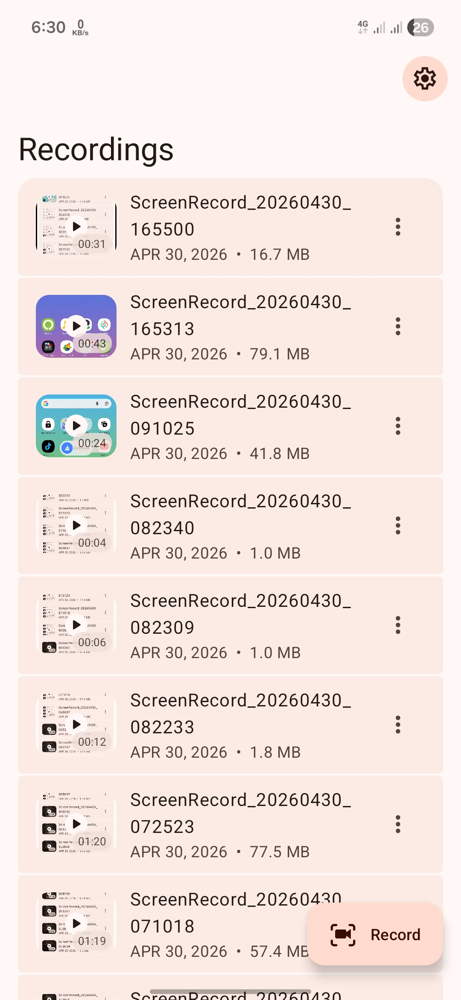
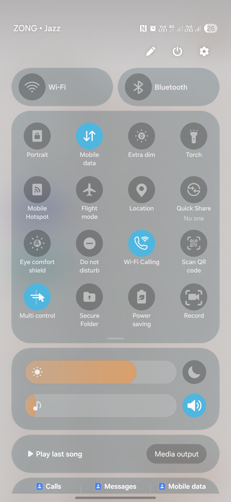
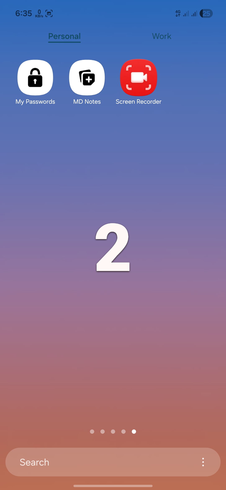

<div align="center">
  
  <h1>Pro Screen Recorder</h1>

  <p><b>Minimal &#8226; Fast &#8226; Material 3 Expressive Screen Recorder</b></p>
  <p>Developed by Mohammed Tahriyne</p>
</div>

---

## Preview

<div align="center">






<br/>




</div>

---

A modern Android screen recorder built in Kotlin using the `MediaProjection` API.  
Designed for speed, clarity, and a smooth Material 3 Expressive experience.

---

## Features

- Capture your screen in the **highest resolution your device supports**
- Pause anytime and resume instantly without breaking the recording
- Floating control pill with quick **Pause &#8226; Resume &#8226; Stop** actions
- Clean 3-second countdown before recording starts
- Start recording directly from the Quick Settings tile
- Crafted with **Material 3 Expressive UI** for a modern look
- Minimal interface focused on usability and clarity
- Lightweight build with efficient memory usage
- Auto-save recordings to `DCIM / ScreenRecorder /`
- Uses modern MediaStore API for compatibility
- Smooth and stable recording across devices

---

## Build Requirements

- Android Studio (latest recommended)  
- Android SDK 36  
- Minimum SDK 26 (Android 8.0)  
- Gradle 9+  
- Java 17  

---

## Contact

- YouTube: https://youtube.com/@mohammedtahriyne
- Instagram: https://www.instagram.com/mohammed_tahriyne
- Facebook: https://www.facebook.com/MohammedTahriyne2002
- Support Email: mtahriyne20@gmail.com

---

## License

```
MIT License

Copyright (c) 2024 Mohammed Tahriyne

Permission is hereby granted, free of charge, to any person obtaining a copy
of this software and associated documentation files (the "Software"), to deal
in the Software without restriction, including without limitation the rights
to use, copy, modify, merge, publish, distribute, sublicense, and/or sell
copies of the Software, and to permit persons to whom the Software is
furnished to do so, subject to the following conditions:

The above copyright notice and this permission notice shall be included in all
copies or substantial portions of the Software.

THE SOFTWARE IS PROVIDED "AS IS", WITHOUT WARRANTY OF ANY KIND, EXPRESS OR
IMPLIED, INCLUDING BUT NOT LIMITED TO THE WARRANTIES OF MERCHANTABILITY,
FITNESS FOR A PARTICULAR PURPOSE AND NONINFRINGEMENT. IN NO EVENT SHALL THE
AUTHORS OR COPYRIGHT HOLDERS BE LIABLE FOR ANY CLAIM, DAMAGES OR OTHER
LIABILITY, WHETHER IN AN ACTION OF CONTRACT, TORT OR OTHERWISE, ARISING FROM,
OUT OF OR IN CONNECTION WITH THE SOFTWARE OR THE USE OR OTHER DEALINGS IN THE
SOFTWARE.
```
